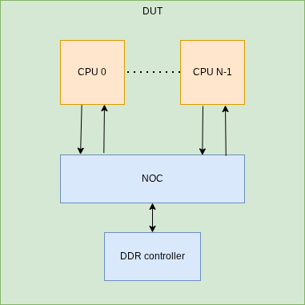
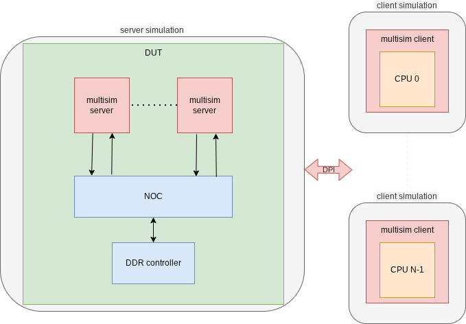

<div align="center">


simulate your RTL with real multi-threaded speed  
interface different simulators, chiplets and platforms together
</div>

# 💡 rationale

`multisim` is a systemverilog/DPI library allowing multiple simulations/platforms to run in parallel and communicate to simulate your DUT.

Typically, you can have:
* 1 **server simulation** with your DUT skeleton (NOC, fabric, etc)
* N **client simulations** with 1 big instance each (computing core, chip, etc)

## example: normal vs multisim simulation
Assuming your original simulation has N CPUs that take a lot of simulation time.

You could transform this DUT:  


Into this one, running on N+1 simulation instances:  


If the CPU is the bottleneck in terms of performance, you could speed up your simulation N times.

# 🚄 performance
Reusing [this example](./example/sim_server/sim_client/core/multi/src) where we have:
* 1 **server simulation** with 1 NOC
* `CPU number` **client simulations** with 1 `cpu` (slow module) each


# ⚙ usage
## available modules
* core library (ready/valid protocol)
    * `client->server`: [multisim_client_push](./src/core/multisim_client_push.sv) and [multisim_server_pull](./src/core/multisim_server_pull.sv)
    * `server->client`: [multisim_server_push](./src/core/multisim_server_push.sv) and [multisim_client_pull](./src/core/multisim_client_pull.sv)
* other protocols:
  * [axi](./src/axi/)
  * [apb](./src/apb/)
  * [quasi static signals](./src/quasi_static/) (useful for signals without control signals like IRQ)

## examples
All examples can be found [here](./example):

Tested platform combinations:

| client \ server | sim | emu | sw |
| - | - | - | - |
| sim | ✅ [examples](./example/sim_server/sim_client/) | ❓ untested | ❓ untested |
| emu | ❓ untested | ❓ untested | ❓ untested |
| sw | ✅ [examples](./example/sim_server/sw_client/) | ✅ [examples](./example/emu_server/sw_client/) | ❓ untested |

## channels
* **server simulation** and **client simulations** communicate through channels
* channels direction can be `client->server` or `server->client`
* each **simulation** can use multiple channels
* `multisim` modules need a unique `server_name` to link a client/server channel together
* client modules need to set `SERVER_RUNTIME_DIRECTORY` to know the port/ip address of each channel

## end of simulation
* **server simulation** can stop the simulation normally (`$finish`, etc)
* **client simulations** must not stop the simulation themselves
  * they will automatically be stopped when the **server simulation** is done

## compilation
1. source [env.sh](./env.sh)
2. pass the right files to your simulator:
* server simulation, see [example](./example/sim_server/sim_client/core/multi/run_cpu)
* client simulation, see [example](./example/sim_server/sim_client/core/multi/run_top)

### shared libs

[multisim_client](./src/core/multisim_client.cpp) and [multisim_server](./src/core/multisim_server.cpp) can be compiled as shared objects with the following command:

```bash
make RELEASE_DIR=... TARGET=SIMULATION|EMULATION|SW
```

The .so libs their headers are located in `RELEASE_DIR`.

# ⚖ pros and cons
Pros:
* speed: split your big DUT in as many smaller parts as you want
* interoperability: can use different simulators/platforms combinations (Verilator, VCS, Questa, Xcelium, Veloce, Palladium, Zebu, Qemu etc)
* scalability: as long as you have enough CPUs on your server

Cons:
* ⚠ **no cycle accuracy** ⚠: functionally accurate, but not cycle accurate
* harder debug: waveforms split on N+1 simulation, no time coherency in between them

# 🚀 future
* X/Z support
* simple transaction logging to help debug
